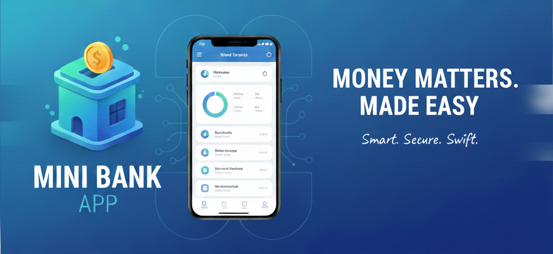
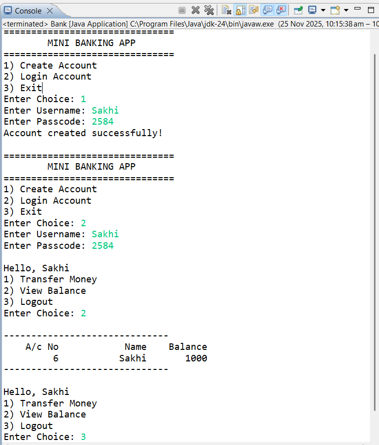

# Mini Banking App




---

## Project Overview
The **Mini Banking App** is a console-based Java application that simulates basic banking operations such as account creation, login, balance inquiry, and fund transfer. It uses **JDBC** to connect and interact with a **MySQL** database, enabling reliable execution of SQL operations and transaction management.

---

## Problem Statement
Managing banking operations manually is prone to errors. This project provides a simple, interactive system for users to simulate banking transactions, helping developers practice Java programming, database connectivity, and transaction handling.

---

## Features
- Create new bank accounts with unique username and passcode.
- Login to existing accounts securely.
- View account balance.
- Transfer money to another customer.
- Prevent transferring money to your own account.
- Logout and return to main menu.
- Input validation and basic error handling.

---

## Technologies Used
- **Java (JDK 8+)** – core programming language
- **JDBC** – Java Database Connectivity for MySQL
- **MySQL** – database to store customer accounts
- **BufferedReader** – for console input handling

---

## File Structure
- `Bank.java` – Main class for menu-driven user interface.
- `BankManagement.java` – Handles account creation, login, balance inquiry, and fund transfers.
- `DBConnection.java` – Manages database connection setup.
- `bankManagement.java` – Core business logic for transactions.

---

## Prerequisites
- MySQL installed and running
- Eclipse IDE or any Java IDE
- MySQL JDBC Connector JAR

---

## Usage

1. Launch the application.
2. Main menu options:

   * `1` – Create Account
   * `2` – Login Account
   * `3` – Exit
3. After login, you can:

   * `1` – Transfer Money
   * `2` – View Balance
   * `3` – Logout
4. Follow on-screen prompts for operations.

**Sample Output:**


<!-- ```
Welcome to InBank
===============================
1) Create Account
2) Login Account
3) Exit
Enter Choice: 2
Enter Username: pritesh
Enter Password: 123
Hello, pritesh! What would you like to do?
1) Transfer Money
2) View Balance
3) Logout
Enter Choice: 2
-------------------------------------------------
  Account No    Customer Name     Balance
        112           pritesh     1000.00
-------------------------------------------------
``` -->

---

## Future Improvements

* Implement GUI using JavaFX or Swing.
* Add transaction history for each account.
* Secure passwords using encryption.
* Support multiple concurrent users with multi-threading.
* Include unit testing for reliability.

---

## Author

**RajibLochan Pramanik**<br>
Email: [pramanikrajib715@example.com](mailto:pramanikrajib715@example.com)  
GitHub: [https://github.com/RajibPramanik](https://github.com/RajibPramanik)


